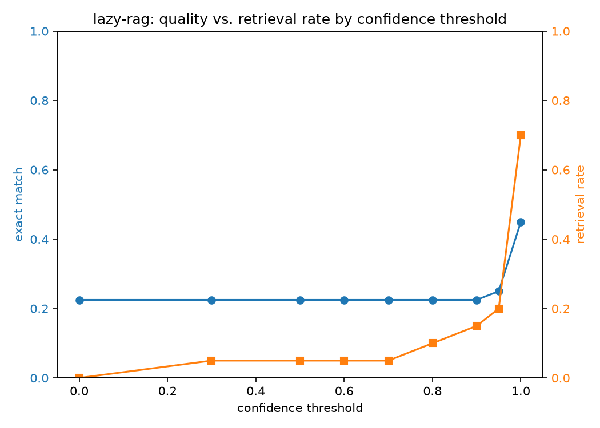

# lazy-rag

Adaptive retrieval for RAG: only retrieve when the model actually needs to.

Most RAG pipelines retrieve on every query, even when the LLM already knows
the answer. This project builds a retrieval trigger based on the model's own
self-reported confidence, and benchmarks it against two baselines:

- **no-RAG** — pure LLM, no retrieval ever
- **always-RAG** — retrieve for every query
- **lazy-rag** — retrieve only when self-reported confidence falls below a threshold

Related work this builds on / benchmarks against: Self-RAG (Asai et al.),
FLARE (Jiang et al.), Adaptive-RAG (Jeong et al.).

## Finding: self-verbalized confidence is a weak retrieval trigger

Benchmark: 40 questions sampled from [PopQA](https://huggingface.co/datasets/akariasai/PopQA)
(long-tail, low-popularity entity facts — deliberately hard for a model to know
from pretraining alone), retrieving against a corpus of Wikipedia summaries for
the relevant entities. Model: `qwen/qwen3.8-27b` via Groq.

| pipeline | EM | F1 | retrieval rate |
|---|---|---|---|
| no-rag | 0.000 | 0.028 | 0% |
| always-rag | 0.500 | 0.582 | 100% |
| lazy-rag (τ=0.6) | 0.225 | 0.265 | 5% |

Sweeping the confidence threshold from 0.0 to 1.0 shows *why*:



Quality stays essentially flat (~0.225 EM) from τ=0.0 through τ=0.9 while
retrieval rate creeps from 0% to 15% — the confidence signal barely
discriminates between questions the model actually knows and questions it's
guessing on. Quality only recovers near τ≥0.95, by which point lazy-rag is
retrieving on 70% of questions anyway — i.e. it has to become "almost
always-rag" before it matches always-rag's quality.

**Root cause, confirmed directly:** of 40 questions, 26 had the model
self-report confidence ≥0.7 while giving a wrong answer — including 4 at
confidence *1.00*. Examples (`data/overconfident_failures.json` has all 26):

| question | confidence | model said (no retrieval) | gold | correct w/ retrieval? |
|---|---|---|---|---|
| Who was the director of *W.*? | 1.00 | Danny Boyle | Oliver Stone | yes |
| Who was the composer of *Alessandro*? | 0.98 | Giuseppe Verdi | George Frideric Handel | yes |
| Who is the author of *So Disdained*? | 0.95 | Nnedi Okofor | Nevil Shute | yes |

The model isn't being deceptive — it's poorly calibrated. Asking an LLM to
verbalize a confidence score doesn't reliably distinguish "I actually know
this" from "this sounds like something I should know." That's consistent
with the broader finding in the calibration literature that natural-language
self-reported confidence correlates weakly with actual correctness.

**Caveat on the numbers:** exact-match scoring is strict and some
"incorrect" retrieval answers were actually right in substance but phrased
differently (e.g. model said "Catholic", gold answer was "Catholic Church").
The qualitative pattern (confident-but-wrong without retrieval) holds
regardless, but the absolute EM numbers likely understate true quality
slightly for both pipelines.

**Implication for future work:** a better trigger likely needs a signal
grounded in the generation itself — e.g. token-level output probability
(FLARE-style) — rather than asking the model to self-assess in natural
language.

## Project structure

```
src/
  config.py            # env/config loading
  llm.py                # Groq API wrapper, retries on rate limits
  retriever.py           # embedding index + retrieval
  confidence.py           # self-verbalized confidence trigger
  pipeline.py             # no-rag / always-rag / lazy-rag pipelines
eval/
  metrics.py              # EM / F1 scoring
  run_eval.py              # runs all 3 pipelines over a QA set, prints comparison table
  threshold_sweep.py        # sweeps lazy-rag across confidence thresholds
  plot_sweep.py               # renders the quality-vs-retrieval-rate chart
  error_analysis.py            # finds confident-but-wrong cases
  prepare_popqa.py              # builds corpus.jsonl / qa.jsonl from PopQA + Wikipedia
data/
  corpus.jsonl              # retrieval corpus (id, text)
  qa.jsonl                    # full eval set (question, answer)
  qa_subset.jsonl               # smaller subset for fast iteration under free-tier rate limits
  sweep_results.json             # threshold sweep output
  sweep_plot.png                  # quality vs retrieval-rate chart
  overconfident_failures.json      # confidence>=0.7-but-wrong cases
```

## Setup

```bash
python -m venv .venv
.venv\Scripts\activate
pip install -r requirements.txt
```

Copy `.env.example` to `.env` and set `GROQ_API_KEY` (free at
[console.groq.com](https://console.groq.com)) and `HF_TOKEN` (free at
[huggingface.co/settings/tokens](https://huggingface.co/settings/tokens),
avoids a rate-limit warning on the embedding-model download).

## Reproducing the results

```bash
python eval/prepare_popqa.py        # builds data/corpus.jsonl + data/qa.jsonl from PopQA
python -m eval.run_eval --qa data/qa_subset.jsonl
python -m eval.threshold_sweep      # sweeps confidence thresholds, writes sweep_results.json
python -m eval.plot_sweep           # renders sweep_plot.png
python -m eval.error_analysis       # finds confident-but-wrong cases
```

Note on model choice: Groq's free tier has per-model daily token caps, and
larger models (`gpt-oss-120b`/`20b`) get exhausted quickly across iterative
runs — `qwen/qwen3.8-27b` was used for the results above because it had a
separate, unused quota bucket. Set `LAZY_RAG_MODEL` in `.env` to try another.

## Roadmap

- [x] Repo scaffold
- [x] Load a benchmark QA set + corpus (PopQA + Wikipedia)
- [x] Confidence-threshold sweep, quality-vs-retrieval-rate plot
- [x] Error analysis on adaptive-RAG failures
- [ ] Token-level uncertainty trigger (FLARE-style) as a second variant, to
      test whether it discriminates known-vs-unknown better than
      self-verbalized confidence
- [ ] Run on the full 150-question set (or larger) once quota allows, to
      confirm the finding holds at scale
