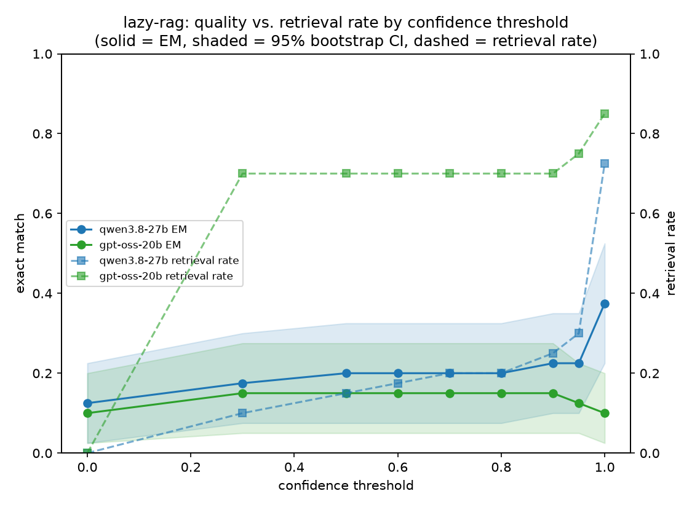

# lazy-rag

[](https://github.com/Jayant2901/lazy-rag/actions/workflows/ci.yml)

Adaptive retrieval for RAG: only retrieve when the model actually needs to.

Most RAG pipelines retrieve on every query, even when the LLM already knows
the answer. This project builds a retrieval trigger based on the model's own
self-reported confidence, and benchmarks it against two baselines:

- **no-RAG** — pure LLM, no retrieval ever
- **always-RAG** — retrieve for every query
- **lazy-rag** — retrieve only when self-reported confidence falls below a threshold

Related work this builds on / benchmarks against: Self-RAG (Asai et al.),
FLARE (Jiang et al.), Adaptive-RAG (Jeong et al.).

## Finding: self-verbalized confidence is a weak retrieval trigger

Benchmark: 40 questions sampled from [PopQA](https://huggingface.co/datasets/akariasai/PopQA)
(long-tail, low-popularity entity facts — deliberately hard for a model to know
from pretraining alone), retrieving against a corpus of Wikipedia summaries for
the relevant entities. Model: `qwen/qwen3.8-27b` via Groq. All EM figures below
are percentile bootstrap means with 95% CIs (1000 resamples); pairwise
comparisons use an exact two-sided sign test on paired per-question outcomes.

| pipeline | EM | 95% CI | F1 | retrieval rate |
|---|---|---|---|---|
| no-rag | 0.000 | [0.00, 0.00] | 0.019 | 0% |
| always-rag | 0.350 | [0.23, 0.50] | 0.491 | 100% |
| lazy-rag (τ=0.6) | 0.100 | [0.00, 0.20] | 0.143 | 17.5% |

- lazy-rag vs always-rag: **p=0.013** (significant) — always-rag won 12 of 14
  discordant pairs. At τ=0.6 the gate under-triggers: it skips retrieval on
  questions where retrieval would have helped.
- lazy-rag vs no-rag: p=0.125 (not significant at n=40) — lazy-rag won all 4
  discordant pairs, but too few to be conclusive at this sample size.

**Retrieval isn't the bottleneck.** `Recall@1 = Recall@3 = Recall@5 = 1.000`
on this corpus (`python -m eval.eval_retrieval`) — the gold document is
always retrieved when retrieval is triggered. Every failure of lazy-rag is
therefore a *calibration* failure (the gate deciding not to retrieve when it
should have), not a retrieval-quality failure.

Sweeping the confidence threshold from 0.0 to 1.0 shows why the gate
struggles, across two different models:



| τ | qwen EM | qwen 95% CI | qwen retrieval | gpt-oss-20b EM | gpt-oss-20b 95% CI | gpt-oss-20b retrieval |
|---|---|---|---|---|---|---|
| 0.0 | 0.125 | [0.03, 0.23] | 0% | — | — | 0% |
| 0.3–0.8 | ~0.20 | [0.08, 0.33] | 10–20% | ~0.10–0.15 | wide, overlapping | ~70% |
| 0.9–0.95 | 0.225 | [0.10, 0.35] | 25–30% | ~0.10–0.15 | wide, overlapping | ~70–85% |
| 1.0 | 0.375 | [0.23, 0.53] | 72.5% | ~0.10–0.15 | wide, overlapping | 85% |

**Honest read, not oversold:** for qwen, EM is essentially flat across
τ=0.3–0.95 — the 95% CIs for every threshold in that range overlap almost
completely, so the apparent trend is noise around one plateau at n=40, not a
real effect. Only τ=1.0 stands out with a higher point estimate, and even
that overlaps substantially with τ=0.9's interval. For gpt-oss-20b the
pattern is non-monotonic and, again, every threshold's CI overlaps every
other's — at this sample size the confidence signal doesn't reliably
discriminate thresholds from each other for either model. The one thing both
models agree on: retrieval rate only really moves once τ approaches 1.0,
meaning the gate has to become "almost always-rag" before it behaves
differently from a flat baseline.

**Root cause, confirmed directly:** of 40 questions, 26 had the model
self-report confidence ≥0.7 while giving a wrong answer — including 4 at
confidence *1.00*. Examples (`data/overconfident_failures.json` has all 26;
exact figures shift run-to-run since LLM sampling isn't deterministic, but
the qualitative pattern is stable):

| question | confidence | model said (no retrieval) | gold | correct w/ retrieval? |
|---|---|---|---|---|
| Who was the director of *W.*? | 1.00 | Danny Boyle | Oliver Stone | yes |
| Who was the composer of *Alessandro*? | 0.98 | Giuseppe Verdi | George Frideric Handel | yes |
| Who is the author of *So Disdained*? | 0.95 | Nnedi Okofor | Nevil Shute | yes |

The model isn't being deceptive — it's poorly calibrated. Asking an LLM to
verbalize a confidence score doesn't reliably distinguish "I actually know
this" from "this sounds like something I should know." That's consistent
with the broader finding in the calibration literature that natural-language
self-reported confidence correlates weakly with actual correctness.

**Caveat on the numbers:** exact-match scoring is strict and some
"incorrect" retrieval answers were actually right in substance but phrased
differently (e.g. model said "Catholic", gold answer was "Catholic Church").
The qualitative pattern (confident-but-wrong without retrieval) holds
regardless, but the absolute EM numbers likely understate true quality
slightly for both pipelines.

**Implication for future work:** a better trigger likely needs a signal
grounded in the generation itself — e.g. token-level output probability
(FLARE-style) — rather than asking the model to self-assess in natural
language.

## Project structure

```
src/
  config.py            # env/config loading
  llm.py                # Groq API wrapper, retries on rate limits
  retriever.py           # embedding index + retrieval (FAISS, cached by corpus hash) + Recall@k
  confidence.py           # self-verbalized confidence trigger
  pipeline.py             # no-rag / always-rag / lazy-rag pipelines
eval/
  metrics.py              # EM / F1 scoring, bootstrap_ci
  significance.py          # exact paired sign test
  run_eval.py               # runs all 3 pipelines over a QA set, prints comparison + significance
  threshold_sweep.py         # sweeps lazy-rag across confidence thresholds (with bootstrap CIs)
  plot_sweep.py                # renders quality-vs-retrieval-rate chart, supports multi-model overlay
  eval_retrieval.py             # standalone Recall@k reporter
  error_analysis.py              # finds confident-but-wrong cases
  prepare_popqa.py                # builds corpus.jsonl / qa.jsonl from PopQA + Wikipedia
tests/
  test_metrics.py                 # normalize/EM/F1/bootstrap_ci unit tests
  test_confidence.py               # confidence-parsing unit tests
data/
  corpus.jsonl              # retrieval corpus (id, title, text)
  qa.jsonl                    # full eval set (question, answer, gold_title)
  qa_subset.jsonl               # smaller subset for fast iteration under free-tier rate limits
  eval_results_n40.json          # 3-pipeline eval output (EM/F1/CI/significance)
  sweep_results.json              # qwen threshold sweep output
  sweep_results_gpt-oss-20b.json   # gpt-oss-20b threshold sweep output
  sweep_plot_multimodel.png         # quality vs retrieval-rate chart, both models overlaid
  overconfident_failures.json        # confidence>=0.7-but-wrong cases
```

## Setup

```bash
python -m venv .venv
.venv\Scripts\activate
pip install -r requirements.txt
```

Copy `.env.example` to `.env` and set `GROQ_API_KEY` (free at
[console.groq.com](https://console.groq.com)) and `HF_TOKEN` (free at
[huggingface.co/settings/tokens](https://huggingface.co/settings/tokens),
avoids a rate-limit warning on the embedding-model download).

## Reproducing the results

```bash
python eval/prepare_popqa.py        # builds data/corpus.jsonl + data/qa.jsonl from PopQA
python -m eval.run_eval --qa data/qa_subset.jsonl --out data/eval_results_n40.json
python -m eval.threshold_sweep --qa data/qa_subset.jsonl   # sweeps thresholds, writes sweep_results.json
python -m eval.plot_sweep --results data/sweep_results.json data/sweep_results_gpt-oss-20b.json \
    --labels qwen3.8-27b gpt-oss-20b --out data/sweep_plot_multimodel.png
python -m eval.eval_retrieval --qa data/qa_subset.jsonl    # Recall@k
python -m eval.error_analysis                              # finds confident-but-wrong cases
pytest tests/ -v                                            # unit tests (no network/API calls)
```

Note on model choice: Groq's free tier has per-model daily token caps, and
larger models (`gpt-oss-120b`/`20b`) get exhausted quickly across iterative
runs. Results above use two models with separate quota buckets —
`qwen/qwen3.8-27b` and `openai/gpt-oss-20b` — specifically so the finding
could be checked for consistency across models rather than resting on one.
Set `LAZY_RAG_MODEL` in `.env` to try another.

Evaluation was run at n=40 rather than the full 150-question set: Groq's
free-tier tokens-per-minute limit degrades sharply on sustained runs (call
latency climbs from ~1s to 100s+ per item after ~20-30 calls in a window),
making a 450-call full run impractical to complete without multi-hour waits.
The n=40 subset was chosen deliberately small enough to finish reliably
while still supporting bootstrap CIs and a paired significance test.

## License

[MIT](LICENSE)

## Roadmap

- [x] Repo scaffold
- [x] Load a benchmark QA set + corpus (PopQA + Wikipedia)
- [x] Confidence-threshold sweep, quality-vs-retrieval-rate plot
- [x] Error analysis on adaptive-RAG failures
- [x] Bootstrap confidence intervals + paired significance testing
- [x] Recall@k to isolate retrieval quality from generation quality
- [x] Second-model replication sweep (gpt-oss-20b) to check the finding holds
      across models
- [x] Unit tests + CI
- [x] Embedding-index caching
- [ ] Token-level uncertainty trigger (FLARE-style) as a second variant, to
      test whether it discriminates known-vs-unknown better than
      self-verbalized confidence
- [ ] A second QA dataset beyond PopQA, to check the finding isn't specific
      to long-tail entity questions
